# TaxisBase

TaxisBase is the foundational semantic model of [TaxisDB](https://taxisdb.com), a metamodel-driven, reflective, temporal, immutable, fact-oriented database engine built on YottaDB.

It provides the vocabulary and semantics for representing entities, attributes, types, values, relationships, assertions, retractions, identity, constraints, and history as data.

[](https://github.com/taxisdb/taxisdb)

## Overview

TaxisBase sits between the application and the YottaDB storage substrate.

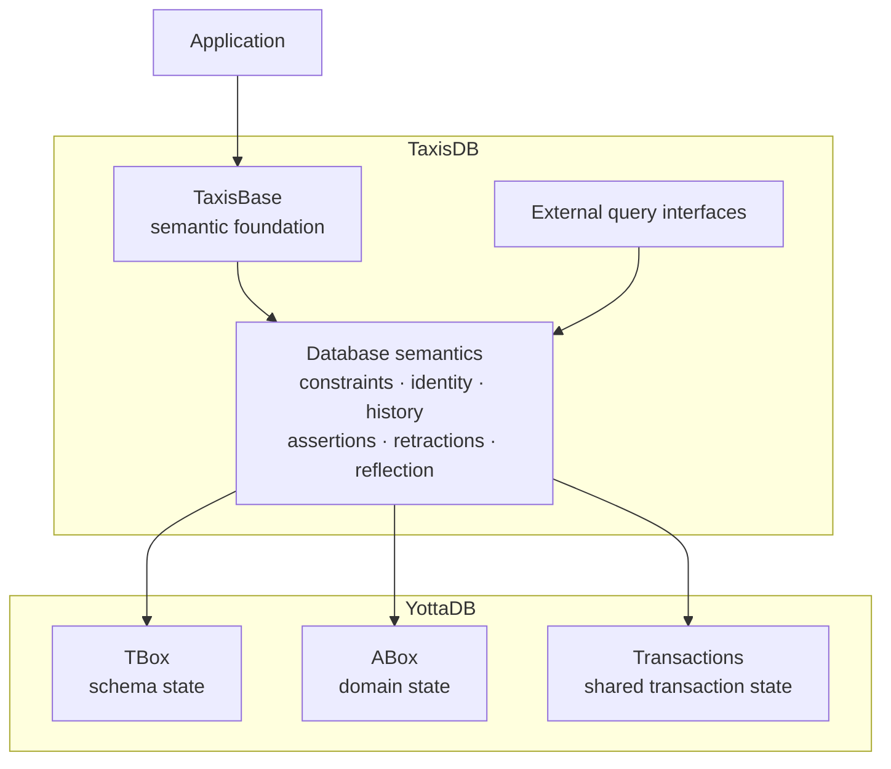

TaxisBase defines what the database means. YottaDB provides the transactional persistence mechanism underneath it.

## Core Features

| Feature                       | Description                                                                                    |
| ----------------------------- | ---------------------------------------------------------------------------------------------- |
| Temporal                      | Database state can be reconstructed across transaction history                                 |
| Immutable facts               | Existing facts are never overwritten; changes are represented as new assertions or retractions |
| Fact-oriented                 | Information is represented as entity, attribute, transaction, value assertions                 |
| Metamodel-driven              | Types, attributes, constraints, and values are themselves represented as data                  |
| Reflective                    | The database can inspect and discover its own model                                            |
| Namespaced schema             | Entities and attributes use human-readable dotted keys                                         |
| Multi-faceted entities        | Objects can be described through multiple independently defined associations                   |
| Typed values                  | Attributes declare the kind of values they accept                                              |
| Enumerations                  | Closed sets of named values can constrain attributes                                           |
| Composite values              | Related fields can be represented as a single structured value                                 |
| Referential integrity         | Reference-valued attributes can constrain the type of their targets                            |
| Attribute validation          | Values can be checked by application-defined predicates                                        |
| Entity validation             | Whole entities can be validated across multiple attributes                                     |
| Identity resolution           | Entities can be addressed by EID, unique attribute/value, or human-readable key                |
| Value interning               | Attribute-specific dictionaries provide deterministic value keys                               |
| Unique insert                 | Duplicate values can be rejected                                                               |
| Unique upsert                 | Existing entities can be resolved and updated through unique values                            |
| Transactional writes          | Staged changes are committed atomically through YottaDB transactions                           |
| Independent TBox/ABox storage | Schema and domain data occupy separate physical regions                                        |
| Shared transaction ordering   | TBox and ABox share one monotonic transaction sequence                                         |
| SQL integration               | Entity snapshots can be exported for YDB Octo                                                  |
| Observability                 | The transaction region provides process-scoped debug logging                                   |

## The TaxisBase Model

TaxisBase organizes database semantics around a small number of foundational concepts.

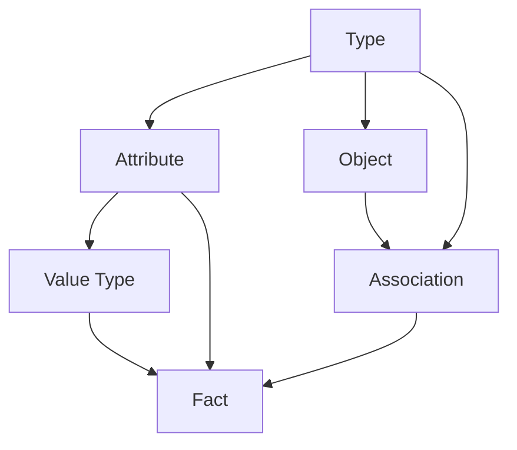

### Types

A type is a conceptual grouping of attributes describing a particular aspect of an entity.

Types are identified through namespaced keys such as:

```text
sys.type.attr
sys.type.obj
sys.type.assoc
sandbox.movie
sandbox.person
```

A TaxisBase type is not equivalent to a rigid programming-language class. It is closer to a semantic grouping over the EAV model, where attributes sharing a namespace define a particular vocabulary.

An entity can therefore participate in multiple facets without requiring a single flat structural type.

### Attributes

Every attribute is itself an entity and an instance of:

```text
sys.type.attr
```

An attribute describes a property of an entity and carries metadata such as:

```text
sys.attr.key
sys.attr.range
sys.attr.cardinality
sys.attr.unique
sys.attr.required
sys.attr.validation
sys.attr.exptype
sys.attr.isa
```

For example:

```text
sandbox.movie.title
```

can be defined as a single-valued string attribute, while:

```text
sandbox.movie.imdbid
```

can additionally be constrained to be unique.

### Value Types

Value types describe what shape an attribute's values take.

TaxisBase provides three major categories:

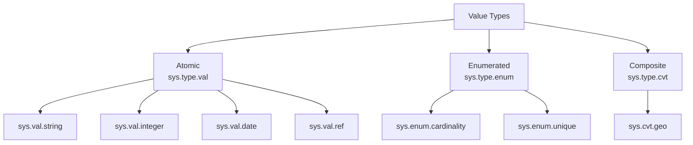

Atomic values represent indivisible values such as strings, integers, dates, timestamps, UUIDs, URLs, and references.

Enumerated values represent closed vocabularies such as:

```text
sys.enum.cardinality.one
sys.enum.cardinality.many
```

Composite value types group several related fields into one structured value, such as:

```text
sys.cvt.geo
```

## Range, Domain, and Value Domain

TaxisBase distinguishes three different questions that are often conflated in database systems.

| Concept                | Question                                             |
| ---------------------- | ---------------------------------------------------- |
| Attribute domain       | Which kind of entity may carry this attribute?       |
| Attribute range        | What kind of value may the attribute contain?        |
| Attribute value domain | Which concrete values have actually been registered? |

For example:

```text
sandbox.movie.title
```

may have:

```text
domain  = sandbox.movie
range   = sys.val.string
```

The attribute's dictionary then contains the concrete strings that have been interned for that attribute.

For reference-valued attributes, `sys.attr.exptype` can further constrain the referenced entity:

```text
range   = sys.val.ref
exptype = sys.enum.cardinality
```

This means the value must be an entity reference, and the referenced entity must specifically belong to the required type.

## Objects and Associations

An object represents the underlying topic being described.

```text
sys.type.obj
```

An association represents a particular facet or perspective through which that object is described.

```text
sys.type.assoc
```

This allows one real-world topic to have multiple independently modeled characteristics.

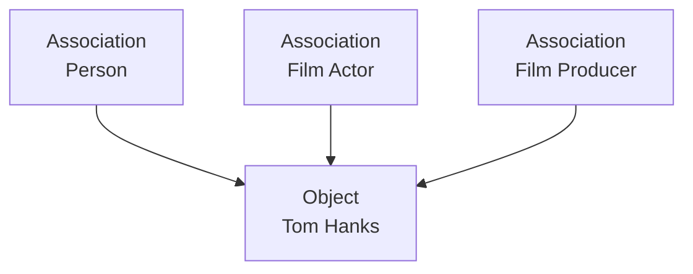

The object maintains its fundamental identity while associations provide additional semantic perspectives.

This is particularly useful for domains where entities naturally participate in multiple roles or relationships.

## The Seven Foundational System Types

The TaxisBase type system begins with seven foundational system types.

| EID | Key              | Abbreviation | Purpose                      |
| --: | ---------------- | ------------ | ---------------------------- |
| 100 | `sys.type.val`   | DTYPE        | Atomic value types           |
| 200 | `sys.type.attr`  | ATYPE        | Attribute definitions        |
| 300 | `sys.type.enum`  | ENUM         | Enumerated value types       |
| 500 | `sys.type.cvt`   | CVT          | Composite value types        |
| 700 | `sys.type.type`  | TYPE         | Foundational entity types    |
| 800 | `sys.type.assoc` | ASSOC        | Relationship and facet types |
| 900 | `sys.type.obj`   | OBJ          | Concrete objects             |

These types bootstrap the semantic vocabulary from which the rest of the database model is constructed.

## Namespaces

Keys are human-readable and organized hierarchically.

```text
sys
├── sys.attr.*
├── sys.val.*
├── sys.enum.*
├── sys.cvt.*
└── sys.type.*

sandbox
├── sandbox.movie.*
├── sandbox.person.*
└── sandbox.dlc.*

people
└── people.person.*
```

The `sys` namespace is reserved for the TaxisDB bootstrap vocabulary.

Application namespaces such as `sandbox` or `people` contain domain-specific definitions.

A key such as:

```text
people.person.birthDate
```

therefore communicates both the semantic context and the property being described.

## Keys as a Global Semantic Address Space

Every entity receives a `sys.attr.key` assertion.

The key attribute therefore acts as the master registry for the entire TaxisBase namespace hierarchy.

```text
sys.val.string
sys.enum.cardinality.one
sys.type.obj
sandbox.movie
sandbox.movie.title
people.person
people.person.birthDate
```

All of these keys participate in the same resolvable keyspace.

This provides a human-readable addressing layer on top of the internal entity identifiers.

## Entity Identity

TaxisBase supports three principal identity formats.

| Format          | Example                | Purpose                            |
| --------------- | ---------------------- | ---------------------------------- |
| Raw EID         | `654f2564f8165hevmhe6` | Direct internal identity           |
| Attribute/value | `sandbox.dlc.id\|042`  | Resolve through a unique attribute |
| Bare key        | `obj.tom_hanks`        | Human-readable entity identity     |

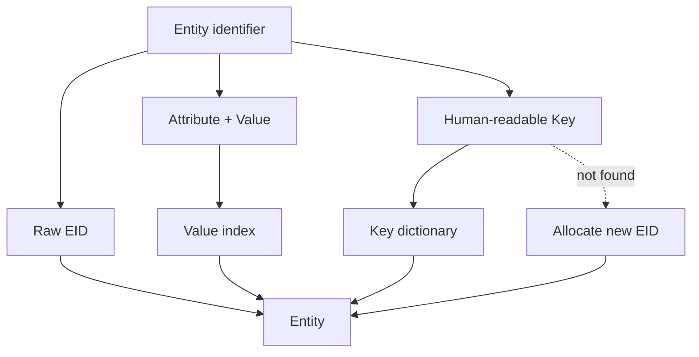

TBox entities use sequential integer identifiers.

ABox entities use 20-character KSUID-style identifiers.

The two identity spaces remain physically and semantically distinct.

## Immutable Facts

TaxisBase does not model updates as destructive replacement.

A fact is asserted:

```text
Assert(entity, attribute, value)
```

or retracted:

```text
Retract(entity, attribute, value)
```

A revision is therefore represented as:

```text
Retract(old value)
Assert(new value)
```

within the same transaction.

This preserves the complete history of the database.

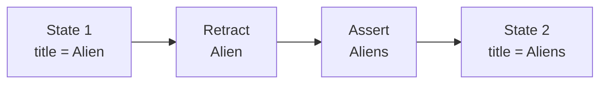

Historical state is not reconstructed from an audit log layered outside the database model. The assertions themselves form the historical record.

## EATV Datoms

The primary ABox representation is:

```text
^EATV(eid, aid, tx, valkey) = operation
```

Each datom represents:

```text
(entity, attribute, transaction, value, operation)
```

The `tx` component is a transaction identifier, not a wall-clock timestamp.

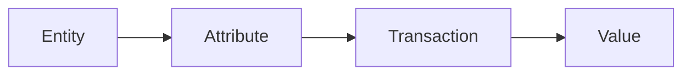

Because YottaDB stores subscripts in collation order, the EATV layout naturally supports entity-centric traversal and historical reconstruction.

Current-state resolution only needs the highest transaction for an entity/attribute pair, giving a fixed small bound on the datoms that must be examined at the latest transaction.

## Value Interning

TaxisBase does not store arbitrary literals directly as assertion subscripts.

Values are interned into attribute-specific dictionaries.

```text
^TBD(aid,valkey)  = literal
^TBDR(aid,literal) = valkey
```

The relationship is:

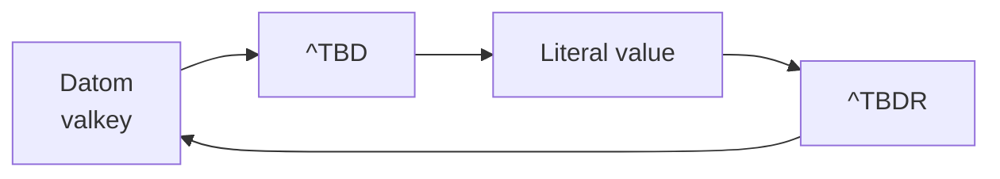

Each attribute therefore has its own value vocabulary.

This provides:

* deterministic value keys
* efficient reverse lookup
* attribute-specific uniqueness checks
* compact datom storage
* materialized value domains
* efficient identity resolution

The same mechanism is used for both system attributes and application attributes.

## Constraints and Validation

TaxisBase performs validation at multiple semantic levels.

### Attribute-level constraints

Attributes can specify:

```text
range
cardinality
unique
required
validation
exptype
```

### Entity-level constraints

Entities can additionally be validated using:

```text
sys.attr.ensure
sys.attr.entattributes
sys.attr.entvalidation
```

The distinction is:

```text
sys.attr.validation
    validates one value

sys.attr.entvalidation
    validates an entity as a whole
```

This permits both local type validation and cross-attribute semantic validation.

## Cardinality and Uniqueness

TaxisBase models cardinality and uniqueness as explicit semantic concepts.

```text
sys.enum.cardinality.one
sys.enum.cardinality.many

sys.enum.unique.insert
sys.enum.unique.upsert
```

For example:

```text
UNQINSERT
```

rejects a duplicate value.

```text
UNQUPSERT
```

uses the unique value to resolve the existing entity and merge the incoming data with it.

This makes identity resolution part of the write semantics rather than an application-side convention.

## Stage and Transact

TaxisBase separates interpretation from persistence.

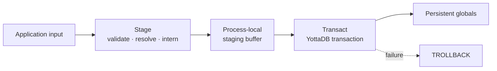

Stage performs interpretation and validation without modifying persistent state.

It:

* resolves entity identities
* resolves attribute identities
* interns values
* validates input
* creates assertions and retractions
* accumulates changes in a local staging buffer

Transact then performs the durable operation inside:

```text
TSTART
...
TCOMMIT
```

If the transaction fails:

```text
TROLLBACK
```

discards the entire persistent write.

This creates a clear boundary between preparation and durable state change.

## Three Physical Regions

TaxisDB uses three YottaDB regions.

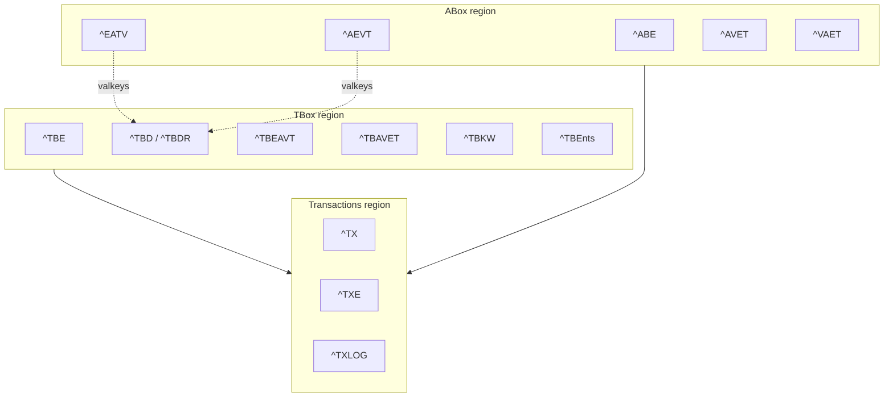

### TBox

Contains schema-level entities and infrastructure:

```text
tbox.dat
tbox.mjl
```

It contains the type system, attributes, dictionaries, schema indexes, keyword structures, and export structures.

### ABox

Contains application-level entities and datoms:

```text
abox.dat
abox.mjl
```

It contains objects, associations, and their asserted facts.

### Transactions

Contains shared transaction state:

```text
transactions.dat
```

It maintains the global transaction sequence, reverse transaction index, and process log.

The transaction region is shared deliberately so that TBox and ABox changes participate in one global transaction timeline.

## Full Storage Model

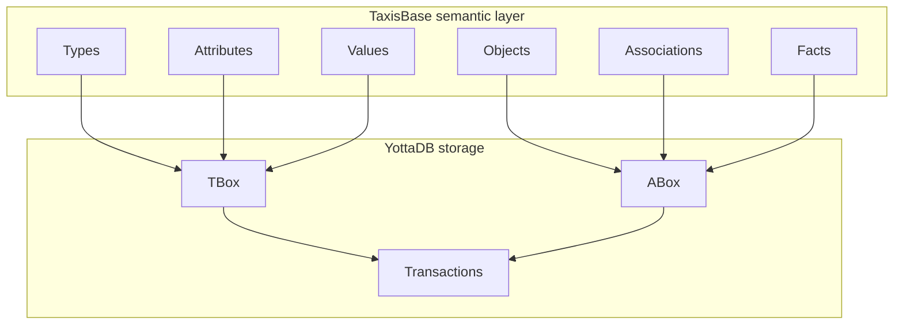

TBox and ABox have independent physical storage and journaling while sharing transaction ordering through the Transactions region.

## Index Architecture

TaxisDB maintains multiple access paths over the same fact model.

| Global    | Region       | Purpose                                      |
| --------- | ------------ | -------------------------------------------- |
| `^TBE`    | TBox         | TBox entity registry                         |
| `^TBD`    | TBox         | Forward value dictionary                     |
| `^TBDR`   | TBox         | Reverse value dictionary and key resolution  |
| `^TBEAVT` | TBox         | Entity-centric schema facts                  |
| `^TBAVET` | TBox         | Value-centric schema lookup                  |
| `^TBKW`   | TBox         | Keyword dictionary                           |
| `^TBEnts` | TBox         | SQL export snapshot                          |
| `^ABE`    | ABox         | ABox entity registry                         |
| `^EATV`   | ABox         | Primary entity-centric datom index           |
| `^AEVT`   | ABox         | Attribute-centric lookup                     |
| `^AVET`   | ABox         | Value-centric lookup and identity resolution |
| `^VAET`   | ABox         | Reverse reference traversal                  |
| `^TX`     | Transactions | Global transaction registry                  |
| `^TXE`    | Transactions | Transaction-to-entity index                  |
| `^TXLOG`  | Transactions | Process-level debug logging                  |

All relevant indexes are updated atomically during transaction commit.

## SQL and External Querying

Querying is deliberately separated from the core semantic and write model.

TaxisDB can export a denormalized snapshot:

```text
^TBEnts(eid, ekey, akey) = val
```

which can then be consumed by YDB Octo.

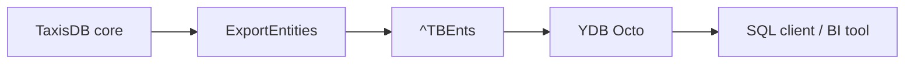

This keeps query execution orthogonal to TaxisDB's core responsibilities while still providing a practical SQL interface.

## Logging and Observability

TaxisBase provides process-level logging through the shared Transactions region.

```text
^TXLOG($JOB, session, seq)
```

The logging system supports:

```text
DEBUG
INFO
WARNING
ERROR
CRITICAL
```

Sessions are scoped to the YottaDB process and maintain monotonically increasing sequence numbers.

This provides visibility into the assertion, validation, staging, and transaction pipeline without making logging part of the semantic fact model.

## YottaDB as the Substrate

YottaDB provides the persistence and transaction substrate beneath TaxisBase.

Its architectural characteristics are particularly well suited to the design:

* hierarchical sparse globals
* in-process database access
* native transaction control
* locking and concurrency control
* journaling
* crash recovery
* replication
* mature M/MUMPS lineage

The resulting separation is intentional:

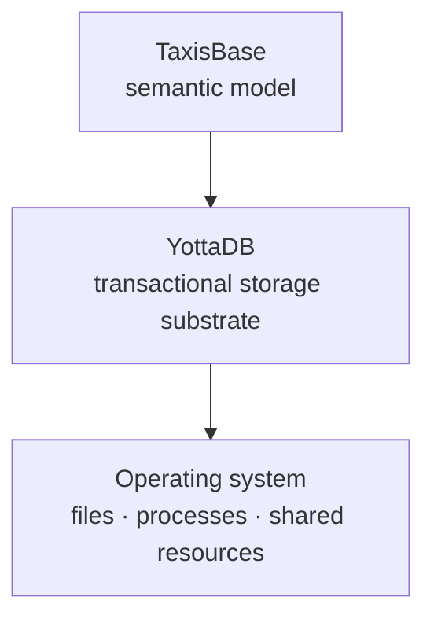

TaxisBase defines facts, entities, attributes, types, identity, constraints, and temporal semantics.

YottaDB provides durable state management.

## TaxisBase and Related Models

TaxisBase draws ideas from several established database and knowledge representation systems, but combines them into a distinct architecture.

| Model      | Relationship to TaxisBase                                                                                                                      |
| ---------- | ---------------------------------------------------------------------------------------------------------------------------------------------- |
| Relational | Shares explicit schemas, constraints, indexes, and declarative data concepts, but replaces mutable rows with immutable facts                   |
| EAV        | Shares entity/attribute/value decomposition, while adding transactions, immutable history, typed references, and a metamodel                   |
| RDF        | Shares graph-like assertions and semantic identifiers, but uses explicit attribute metadata, transaction history, and database-native indexing |
| Datalog    | Shares the idea of reasoning over facts rather than mutable records                                                                            |
| Datomic    | Strong conceptual relationship through immutable datoms, identity, temporal history, and a database-as-facts model                             |
| Freebase   | Influences the multi-faceted entity model, associations, and composite value concepts                                                          |
| YottaDB    | Provides the physical transactional substrate rather than the semantic database model                                                          |

### The key distinction

TaxisBase is not simply an EAV schema, an RDF graph, or a relational database implemented on YottaDB.

Its defining combination is:

```text
Metamodel
    +
Immutable Facts
    +
Transaction Time
    +
Typed Values
    +
Reflective Schema
    +
Identity Resolution
    +
Multi-faceted Objects
    +
Transactional Persistence
```

## TaxisBase and Freebase-Style Modeling

TaxisBase adopts a Freebase-like approach to representing entities with multiple semantic facets.

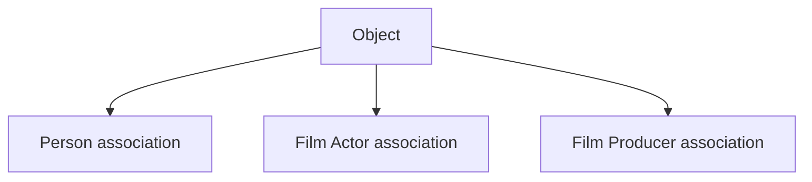

Rather than changing an object's fundamental type every time another characteristic is introduced, additional associations describe the object from independent perspectives.

Composite value types provide another Freebase-inspired construct for representing structured values and n-ary relationships.

## Example: Defining a Movie Schema

A schema can be declared through the same assertion mechanism used for ordinary data.

```mumps
S Movie(1,key)="sandbox.movie.title"
S Movie(1,range)=STRING
S Movie(1,cardin)=ONE
S Movie(1,isa)=ATYPE
S Movie(1,doc)="The title of the movie @en"
S Movie(1,req)=1
S Movie(1,valid)="$$IsLangStr^utils"
S Movie(1,alias)="title"

S Movie(4,key)="sandbox.movie.imdbid"
S Movie(4,range)=STRING
S Movie(4,cardin)=ONE
S Movie(4,isa)=ATYPE
S Movie(4,unq)=UNQINSERT
S Movie(4,req)=1

D Assert^sapi(.Movie)
D Transact^sapi
```

The schema itself is data.

That means the same assertion and transaction machinery can be used to define the model and to populate it.

## Example: Creating an Object

```mumps
S Obj(2,key)="obj.tom_hanks"
S Obj(2,doc)="American actor and filmmaker (born 1956) @en"
S Obj(2,name)="tom_hanks"
S Obj(2,isa)=OBJ
S Obj(2,alias)="TomHanks|%TomHanks"
S Obj(2,label)="Tom Hanks @en"
S Obj(2,wiki)="https://en.wikipedia.org/wiki/Tom_Hanks|https://fr.wikipedia.org/wiki/Tom_Hanks|https://el.wikipedia.org/wiki/Τομ_Χανκς"

D Assert^api(.Obj)
D Transact^api
```

Multiple values can be supplied to multi-valued attributes using the pipe-delimited input convention.

The resulting facts remain individually addressable and historically reconstructable.

## Example: A Fact

Conceptually, a movie title assertion becomes:

```text
(entity, attribute, transaction, value)
```

For example:

```text
obj.tom_hanks
    |
    +-- sandbox.movie.title
            |
            +-- "Example Movie"
```

The stored value is represented through its attribute-specific value key, while the dictionary resolves that key to the corresponding literal.

## Design Principles

TaxisBase is built around several principles:

1. Facts are first-class data.
2. Facts are immutable.
3. History is part of the database model.
4. The schema is itself represented as data.
5. Entity identity is independent from changing attributes.
6. Values are typed independently from their semantic attributes.
7. Attributes explicitly declare their value constraints.
8. Entities can be described through multiple semantic facets.
9. Validation occurs before durable transaction commit.
10. TBox and ABox have distinct physical responsibilities.
11. Transaction ordering remains global across the system.
12. Querying can remain external to the semantic core.
13. Human-readable keys coexist with internal entity identifiers.
14. YottaDB provides the transactional substrate without defining the higher-level semantics.


## Learn More
TaxisBase is a reflective semantic layer for building temporal, immutable, fact-oriented databases where the model, the data, the identities, and the history are all represented through the same underlying assertion machinery.

TaxisBase is the semantic foundation of TaxisDB. The complete documentation covers its metamodel-driven architecture, TBox and ABox model, EAV representation, value types, attributes, constraints, namespaces, identity resolution, objects, associations, and API usage.

Read the full documentation:

<a href="https://taxisdb.com/docs/taxis-base-the-database-of-taxis-db/"> <button class="btn btn-primary"> TaxisBase Documentation </button> </a>


